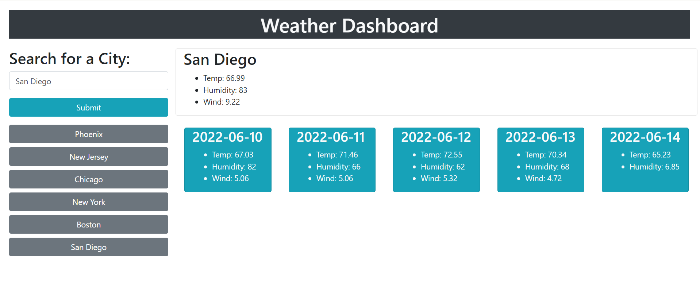

# Weather Dashboard

## Purpose
A website that allows users to check the weather and five day forecast based on their city.

## Built With
* Javascript
* [Server-Side API OpenWeather One Call API](https://openweathermap.org/api/one-call-api)

## Preview

## Website

[https://mmilner29.github.io/weather-dashboard/](https://mmilner29.github.io/weather-dashboard/)

## Contribution
Made with ❤️ by Madi Milner